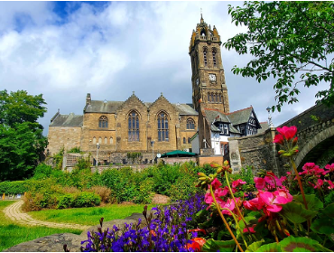

# Information for attendees 

 
Edinburgh is a city of stunning architecture and rich culture, with a vibrant academic scene. 

**Home to both medieval streets and modern innovation**, Edinburgh a great place to explore. From the **Royal Mile** to **Arthur’s Seat**, the **Pentlands** and beyond, the city and its surrounds offer plenty to see and experience! Discover more at [Visit Scotland](https://www.visitscotland.com/)

## Getting to Edinburgh

 
**By aeroplane:**
Edinburgh Airport is served by international and domestic connections. It prides itself to be the Scottish airport from where you can reach most destinations. From the airport, you can take the bus lines 100 (to central Edinburgh) and 400 (southern districts). There is also a tram to central Edinburgh. Taxis can be booked, at short notice, at the taxi stand outside the terminal building.  

**By train**: Travel to Edinburgh Waverley (the main station) or Edinburgh Haymarket, depending on the location of your accommodation.

## Accommodation

 
This is where we'll add information on places to stay.
 
 
 
 

## Conference venue
The conference venue is [The Royal College of Physicians](https://www.rcpe.ac.uk) Edinburgh, ([Google maps](https://maps.app.goo.gl/73jkUjuGj2oSzkX17)).

**Getting there by car**: Metered on-street parking is available at the College’s Queen Street entrance and in surrounding streets at the cost of £5.60 per hour with a maximum stay of three hours between 08:30-17:30 [Parking prices and times](https://www.edinburgh.gov.uk/parking-spaces/parking-prices-times/1)  
A Qpark multi-story car park is located behind the Omni Centre. This is approximately a 10-minute walk from the College.  
The Gallery has clear access directly outside the main entrance, allowing for easy drop-off and collection by car or taxi. There are multiple taxi ranks situated within proximity to the Gallery. 

**Getting there by Train or Tram**: Waverley Train Station is the closest train station, located less than half a mile from the College.    
The nearest tram stop is located at St Andrews Square, providing frequent connections from the city centre to Edinburgh Airport in around 40 minutes. Trams depart frequently through the day from early morning into late evening.

## Conference dinner
The conference dinner is going to be held at [Mansfield Traquair](https://www.mansfieldtraquair.co.uk/) Edinburgh, ([Google maps](https://www.bing.com/maps?q=Mansfield+Traquair&PC=U316&FORM=CHROMN)).

## Satellite workshop
Please refer to the [workshop page](../satellite_workshop/).
