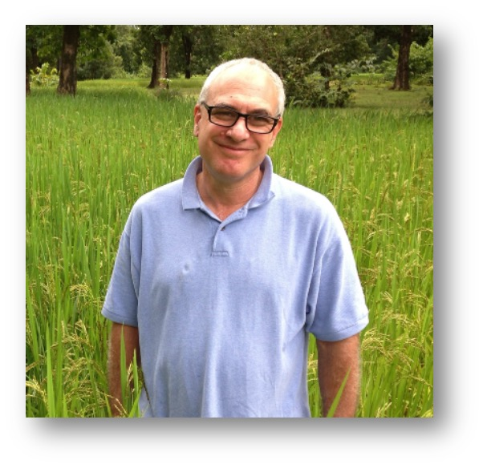
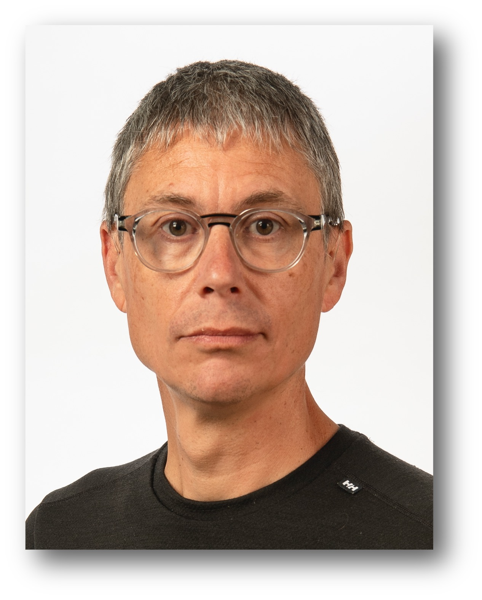
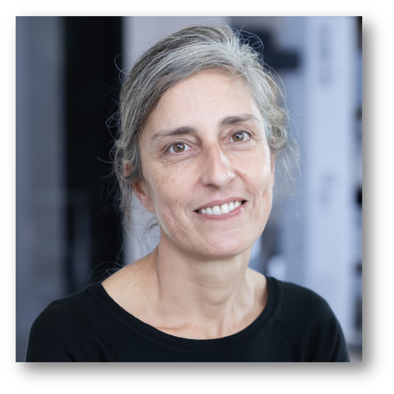
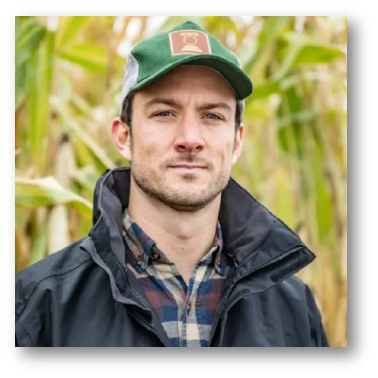
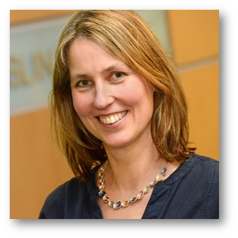

# Invited speakers 

## Gary Atlin, Bill & Melinda Gates Foundation

  

Gary Atlin received BS and MS degrees in crop science at the University of Guelph, then worked as a research associate in the potato program at CIP in Peru for two years.  His PhD work in oat breeding at Iowa State University focused on the design of breeding programs for stressful environments.  He worked as a commercial flax breeder in Alberta, Canada, then taught plant breeding at Nova Scotia Agricultural College for ten years, developing a theoretical framework for managing the fixed and random components of genotype x environment interaction in breeding pipelines in order to maximize genetic gain.  In 2000, he joined IRRI as a rice breeder, establishing IRRI’s drought tolerance pipeline, which resulted in the development of rice varieties with improved drought tolerance that were widely grown in South Asia. His group also identified the first large-effect QTLs affecting rice yield under drought stress.  He joined CIMMYT in 2006 as a maize breeder, and became technical breeding lead in 2009, coordinating efforts to optimize CIMMYT’s maize pipelines to increase genetic gains.  In 2012, he joined the Gates Foundation as a Senior Program Officer in the Agricultural Development R&D team.  He currently manages the foundation’s maize, wheat, and rice breeding portfolios.  Since joining the foundation, he has helped design and implement strategies to increase the rate of genetic gain delivered to smallholders in Sub-Saharan Africa and South Asia.  Recently, he has worked with CGIAR colleagues on the implementation of genomic selection in breeding networks serving highly diverse African cropping systems, using innovative designs to estimate breeding value of selection candidates dispersed across research stations and farms sampling the target population of environments.

## Rosemary Bailey, University of St Andrews
## Hao Cheng, UC Davis
## Sarah Hearne, CIMMYT
## Steven Penfield, John Innes Centre

  

Steven's research group works to understand how weather and climate affect plant reproductive development and seed quality. They are particularly interested in the effects of temperature on crop yields, seed quality and seedling establishment.  

Their work uses crop species from the Brassica family, namely oilseed rape (canola) and vegetable Brassicas, as well as model species such as Arabidopsis thaliana.  

In this way they aim to understand precise mechanisms by which weather and climate affect crop performance, and consider strategies for increasing crop resilience, for instance using conventional plant breeding or genome editing techniques.

## María Xosé Rodríguez-Álvarez, University of Vigo
  

María Xosé Rodríguez Álvarez earned her PhD in Mathematics from the Universidade de Santiago de Compostela (Spain) in 2011 and has a diverse professional background spanning both the private sector and academia. Since 2021, she has been a Ramón y Cajal fellow at the Universidade de Vigo. Her research focuses on (1) developing efficient estimation methods for flexible regression models, (2) statistically evaluating the diagnostic and prognostic value of clinical biomarkers, and (3) proposing new statistical methods for analysing spatial and spatio-temporal processes in the context of agricultural experiments. Her work emphasises practical applications and interdisciplinary collaboration, with a strong commitment to disseminating advancements through free software.

## Pascal Schopp, KWS Group
  

Pascal Schopp is the head of Corn Breeding Europe Mid-Late at KWS.

He received his MSc in Plant Breeding from the University of Hohenheim, Germany, where he continued to study for a PhD.

     
## Julian Taylor, University of Adelaide
## Andrea Wilson, University of Edinburgh
  
Andrea Doeschl-Wilson is Professor of Animal Disease Genetics and Modelling at the Roslin Institute at the University of Edinburgh in the UK, where she leads a research group. Her research group uses mathematical modelling to assess and predict how genetic and non-genetic factors influence host responses and impact to the infectious or harmful social environment of farm animals. She also leads the Roslin Institute Strategic Programme on the Prevention and Control of Infectious Diseases.  

