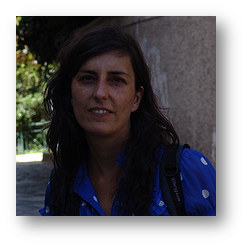

# Speakers 
## Gary Atlin
Bill & Melinda Gates Foundation

  
Gary is a plant breeder, geneticist, and agricultural development specialist with 30 years of experience in the management of research programs in the Americas, Africa, and Asia. He works as a senior Program Officer in the Agricultural Development Initiative, R&D team at the Bill & Melinda Gates Foundation. Gary consultants on cultivar development, breeding program optimization, seed and plant biotechnology investment analysis. His specialties are: Rice, maize, and wheat cultivar development, breeding for abiotic stress tolerance, quantitative genetics and applications of genomic selection, optimization of cultivar and trait development pipelines, agricultural development in Canada, South and Southeast Asia, Africa, and Latin America. He is a leader in the field of management of genotype x environment interaction and the detection and deployment of genes for drought tolerance in plant breeding programs. He has extensive experience in management of plant breeding programs, and in planning and coordinating agricultural research projects in developing countries. Gary is guiding the development of accountability and breeding and genomic information management systems for public plant breeding programs in Africa and South Asia. He is available for consulting on: 

(1) Assessment and optimization of plant breeding and native trait development programs 

(2) Technical evaluation of plant breeding and gene discovery/commercialization investments 

(3) Training and capacity building of plant breeding staff - Application of molecular markers in cultivar development 

(4) Management of plant breeding information 

## Rosemary Bailey
University of St Andrews

  
Rosemary has been a half-time Professor of Statistics in the School of Mathematics and Statistics since 2013. Previously, she held positions in agricultural research at Rothamsted Experimental Station for ten years, along with professorships at Goldsmiths College, University of London, and Queen Mary University of London. 

Her research falls into three main areas: 

(1) **Design and Analysis of Experiments**: This area includes the study of complicated blocking structures, treatment structures, and multi-phase experiments with applications across agriculture, horticulture, biodiversity in ecology, and clinical trials. 

(2) **Combinatorics**: Their work here encompasses block designs, row-column designs, neighbour-balanced designs, and association schemes. 

(3) **Finite Group Theory**: They specialize in the role of permutation groups in the randomization of experimental designs, and the impact of finite Abelian groups in the construction of factorial designs. 

## Hao Cheng

University of California, Davis

 
I have focused on the use of genomics, phenomics, pedigree, and other sources of big data in various species to better predict desired traits. These endeavors include 

(1) theoretical aspects of quantitative genetics including statistical models and computational algorithms (e.g., genomic prediction; genome-wide association studies); 

(2) the development of software tools to apply these methods to real-life large genomic and phenomic data; 

(3) the application of the software to data sets in routine analysis for a wide range of traits in various species.

## Sarah Hearne
CIMMYT

no Photo

Sarah is passionate about the role of agricultural R4D in sustainable development, hunger and poverty alleviation and climate change adaptation. She is leveraging over two decades of experience in agricultural R4D, and working in public and private sectors across East and Southern Africa, West Africa, Latin America and Europe. Sarah places emphasis on data driven, customer oriented targeting and prioritisation of R4D, improving transdisciplinary innovation development, enhancing equitable partnerships and capability development and driving improvement in the delivery of demanded products to farmers and consumers. 

## Steven Penfield
John Innes Centre

 
Steven’s research group works to understand how weather and climate affect plant reproductive development and seed quality.  

They are especially interested in the effects of temperature on crop yields, seed quality and seedling establishment.  

Their work uses crop species from the Brassica family, especially oilseed rape (canola) and vegetable Brassicas, as well as model species such as Arabidopsis thaliana.  

In this way they aim to understand precise mechanisms by which weather and climate affect crop performance, and consider strategies for increasing crop resilience, for instance using conventional plant breeding or genome editing techniques. 

## María Xosé Rodríguez-Álvarez
University of Vigo

 
no introduction

no introduction

no introduction

no introduction

## Pascal Schopp
KWS Group

 
no introduction

no introduction

no introduction

no introduction

## Julian Taylor
University of Adelaide

 
Julian Taylor is an Associate Professor in the Biometry Hub located at the Waite Agricultural Precinct of the University of Adelaide (UA). He is the Node Leader of the Analytics for the Australian Grains Industry in University of Adelaide (AAGI-UA), Grains Research and Development Corporation (GRDC) funded initiative to provide national analytics research support for the Australian grains industry. 

Assoc. Prof. Taylor has a strong foundation of methdological and computational statistics knowledge that he brings into his broad analytics research portfolio. Much of his research is multi-disciplinary and highly collaborative with plant researchers in the university as well across other scientific communities involved in comparative plant breeding research. Through these collaborations he has published broadly in the applied statistics litertaure within a flavour of agricultural reserach. He is also the co-author and maintainer of statistical software packages R/wgaim and R/ASMap written in the open source R statistical computing environment. These packages have provided plant research staff internal and extrenal to the university with highly efficient tools for the genetic analysis of their experiments and continue to play an important role in providing research outcomes for their projects. 

Recently, Assoc Prof. Taylor has become the UA node leader of AAGI, a $36M national GRDC inititiave where UA is one of three national strategic partners with Curtin (AAGI-CU) and University of Queensland (AAGI-UQ), that encompasses a strong analytics network to tackle big data agricultural challenges within the Australian grains industry. Within AAGI-AU he strategically manages a multidisciplinary analytics teams across four schools and fosters the development of collaborative high impact analytics research, support and training activities. AAGI-AU, and other partners on the network, have broadened the analytics toolbox within the Australian grains industry to include biometry, machine learning, artificial intelligence, data science, mathematics as well as computational infrastructure to support the breadth of these analytics activities.   

## Andrea Wilson
University of Edinburgh

 
The Doeschl-Wilson group investigates how the genetics of individuals affects the spread of infectious disease, both within an animal and between animals. We are an interdisciplinary group of scientists aiming to effectively combine field and laboratory experiments with mathematical modelling and quantitative genetics theory, with the ultimate aim to improve livestock health and resilience.   

Research in the Doeschl-Wilson group focuses on the development of mathematical models and computational tools that enhance our understanding how the genetics of individuals and diverse non-genetic factors together influence the dynamics of infectious diseases and their impact on the health and performance of individuals and of entire livestock populations. We use these tools to -DESIGN infection experiments and sampling strategies that let us detect the genetic signal from disease and performance data. -IDENTIFY individuals or genomic regions associated with high genetic resistance or tolerance to infections, or high genetic risk for transmitting infections (infectivity). -PREDICT the impact of genetic and non-genetic control strategies on future disease prevalence and pathogen evolution. We use a wide range of modelling techniques that combine methods from mathematical dynamical systems theory, Bayesian statistics, and quantitative genetics. Applications include virus infections in pigs (Porcine Reproductive and Respiratory Syndrome, PRRS) and chicken (Marek’s disease), gastro-intestinal parasite infections in sheep, bacterial infections in cattle (bovine Tuberculosis), to virus and protozoa infections in fish. We also apply mathematical tools to study genetic effects and group dynamics underlying aggressive behaviour in pigs. Questions we are particularly interested in: Should we aim for genetic improvement in host resistance or tolerance to infectious disease? Are there disease superspreaders in the population and to what extent is superspreading genetically determined? Can we identify individuals with high genetic risk for becoming infected or spreading infections a priori, based on their genetic make-up? To what extent does vaccination with partially protective vaccines reduce disease transmission and pathogen evolution? How can selective breeding help to control infectious disease and minimise its impact on livestock production? We collaborate with researchers and industry partners in the UK, across Europe, USA and Canada, Australia and Africa. 