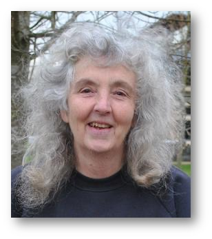
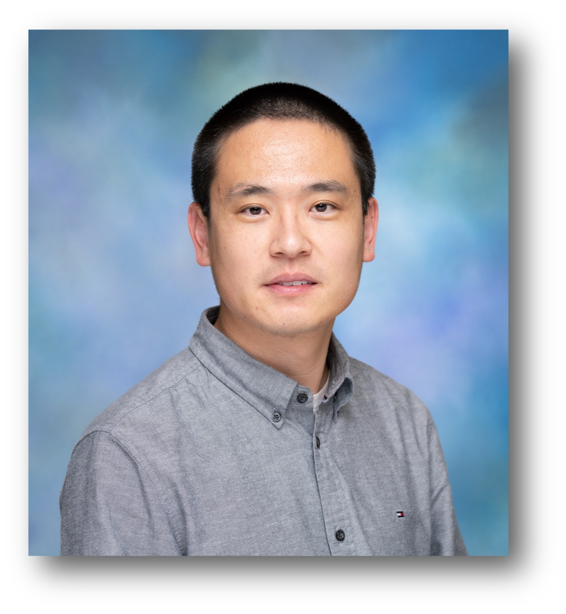

# Invited speakers 

## Gary Atlin, Bill & Melinda Gates Foundation

  

Gary Atlin received BS and MS degrees in crop science at the University of Guelph, then worked as a research associate in the potato program at CIP in Peru for two years.  His PhD work in oat breeding at Iowa State University focused on the design of breeding programs for stressful environments.  He worked as a commercial flax breeder in Alberta, Canada, then taught plant breeding at Nova Scotia Agricultural College for ten years, developing a theoretical framework for managing the fixed and random components of genotype x environment interaction in breeding pipelines in order to maximize genetic gain.  In 2000, he joined IRRI as a rice breeder, establishing IRRI’s drought tolerance pipeline, which resulted in the development of rice varieties with improved drought tolerance that were widely grown in South Asia. His group also identified the first large-effect QTLs affecting rice yield under drought stress.  He joined CIMMYT in 2006 as a maize breeder, and became technical breeding lead in 2009, coordinating efforts to optimize CIMMYT’s maize pipelines to increase genetic gains.  In 2012, he joined the Gates Foundation as a Senior Program Officer in the Agricultural Development R&D team.  He currently manages the foundation’s maize, wheat, and rice breeding portfolios.  Since joining the foundation, he has helped design and implement strategies to increase the rate of genetic gain delivered to smallholders in Sub-Saharan Africa and South Asia.  Recently, he has worked with CGIAR colleagues on the implementation of genomic selection in breeding networks serving highly diverse African cropping systems, using innovative designs to estimate breeding value of selection candidates dispersed across research stations and farms sampling the target population of environments.

## Rosemary Bailey, University of St Andrews

  

R. A. Bailey is Professor of Statistics at the University of St Andrews, and a Fellow of the Royal Society of Edinburgh.   She worked for the Medical Research Council's Air Pollution Research Unit before studying at the University of Oxford, where she obtained a BA in Mathematics and a DPhil in Group Theory. As a post-doctoral fellow at the University of Edinburgh she learnt how to apply group theory to problems in design of experiments. She spent ten years applying this knowledge in the Statistics Department at Rothamsted Experimental Station, before moving to academia, being Head of Department or School at Goldsmiths College and at Queen Mary College, both in the University of London. She was President of the then-British Region of the International Biometric Society from 2000 to 2002, and has also served on various committees of the London Mathematical Society, the Royal Statistical Society and the Institute of Mathematical Statistics.

## Hao Cheng, UC Davis

  

Professor Cheng’s research is broadly involved in the development of statistical, machine learning, and computational methods that bridge the genome and phenome for the genetic improvement of populations through more accurate, efficient, and biologically meaningful analyses. Professor Cheng has focused on the use of genomics, phenomics, and other sources of omics data in various species to better predict desired traits and infer the mechanisms underlying them. This includes the theoretical aspects of quantitative genetics, such as statistical models and computational algorithms (e.g., genomic prediction and association studies), the development of software tools to apply these statistical methods and computational algorithms to real-life, large-scale omic data, and the application of these methods and tools to large datasets for a wide range of traits in various species.

## Sarah Hearne, CIMMYT
## Steven Penfield, John Innes Centre

  

Steven's research group works to understand how weather and climate affect plant reproductive development and seed quality. They are particularly interested in the effects of temperature on crop yields, seed quality and seedling establishment.  

Their work uses crop species from the Brassica family, namely oilseed rape (canola) and vegetable Brassicas, as well as model species such as Arabidopsis thaliana.  

In this way they aim to understand precise mechanisms by which weather and climate affect crop performance, and consider strategies for increasing crop resilience, for instance using conventional plant breeding or genome editing techniques.

## María Xosé Rodríguez-Álvarez, University of Vigo
  

María Xosé Rodríguez Álvarez earned her PhD in Mathematics from the Universidade de Santiago de Compostela (Spain) in 2011 and has a diverse professional background spanning both the private sector and academia. Since 2021, she has been a Ramón y Cajal fellow at the Universidade de Vigo. Her research focuses on (1) developing efficient estimation methods for flexible regression models, (2) statistically evaluating the diagnostic and prognostic value of clinical biomarkers, and (3) proposing new statistical methods for analysing spatial and spatio-temporal processes in the context of agricultural experiments. Her work emphasises practical applications and interdisciplinary collaboration, with a strong commitment to disseminating advancements through free software.

## Pascal Schopp, KWS Group
  

Pascal Schopp is the Head of Corn Breeding Europe Mid-Late at KWS, where he is responsible for germplasm and product development in the mid-early to mid-late dent grain corn markets. He leads multiple breeding programs across Europe.

Pascal holds an MSc in Plant Breeding from the University of Hohenheim, Germany, where he also completed his PhD at the Institute of Applied Plant Breeding. During his PhD studies, Pascal worked on genomic prediction methodology and its application in plant breeding.

## Julian Taylor, University of Adelaide

Julian Taylor is an Associate Professor in the Biometry Hub at the Waite Agricultural Precinct of the University of Adelaide (UA). He is the Node Leader of the Analytics for the Australian Grains Industry in University of Adelaide (AAGI-UA), Grains Research and Development Corporation (GRDC) funded initiative to provide national analytics research support for the Australian Grains Industry. Within AAGI-AU Associate Prof. Taylor strategically manages a multi-disciplinary analytics teams across four schools and fosters the development of collaborative high impact analytics research, support and training activities. AAGI-AU, and other partners on the network, have broadened the analytics toolbox within the Australian grains industry to include biometry, machine learning, artificial intelligence, data science, mathematics as well as computational infrastructure to support the breadth of these analytics activities.

## Andrea Wilson, University of Edinburgh
  
Andrea Doeschl-Wilson is Professor of Animal Disease Genetics and Modelling at the Roslin Institute at the University of Edinburgh in the UK, where she leads a research group. Her research group uses mathematical modelling to assess and predict how genetic and non-genetic factors influence host responses and impact to the infectious or harmful social environment of farm animals. She also leads the Roslin Institute Strategic Programme on the Prevention and Control of Infectious Diseases.  

