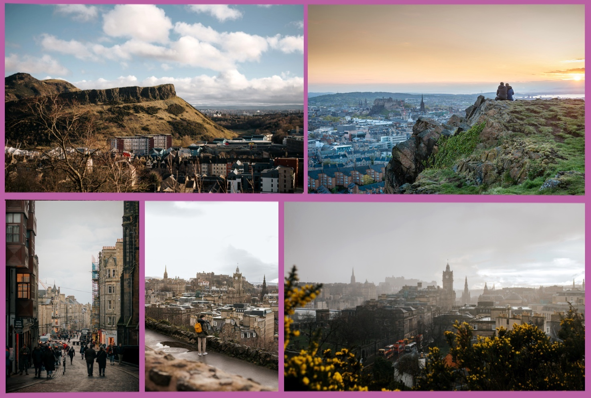

# Social events

Thursday afternoon is allocated for social activities. This allows attendees to be tourists in the truly wonderful city of Edinburgh. There will be a range of activities to choose from. We are planning some unique Edinburgh social activities, including:

| Social events | Linkage for more information |
|---|---|
|Arthurs Seat Hike|	[https://geowalks.scot/arthurs-seat/arthurs-seat-self-guided-walks/](https://geowalks.scot/arthurs-seat/arthurs-seat-self-guided-walks/)|
|Royal Botanical Gardens|	[https://www.rbge.org.uk/](https://www.rbge.org.uk/)|
|National Museum of Scotland|	[https://www.nms.ac.uk/national-museum-of-scotland](https://www.nms.ac.uk/national-museum-of-scotland))
|Surgeons Hall Museum| [https://museum.rcsed.ac.uk/](https://museum.rcsed.ac.uk/)|
|Edinburgh Castle|	[https://www.edinburghcastle.scot/](https://www.edinburghcastle.scot/)|
|Palace of Holyroodhouse|	[https://www.rct.uk/visit/palace-of-holyroodhouse](https://www.rct.uk/visit/palace-of-holyroodhouse)|
|Holyrood Distillery|	[https://holyrooddistillery.co.uk](https://holyrooddistillery.co.uk)|

There will be something to cater for everyone!
We hope the sun will shine, but it's always wise to bring a raincoat in Scotland, just in case!

More details will come soon.

